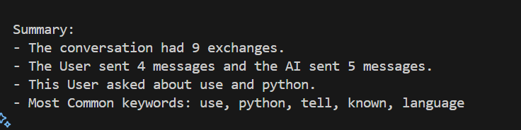

# Running Text-Summarizer

## Prerequisites

Make sure you have the following installed:

- **Python 3.11.9** (Check in terminal with `python --version` or `python3 --version`)
- **pip 25.1.1** (Check in terminal with `pip --version`)

## Setup and Run

### 1. Create a Virtual Environment

Navigate to directory:

```bash
python -m venv venv  # Use python3 if needed
```

This will create a directory named `venv` containing the virtual environment.

### 2. Activate the Virtual Environment

- **Windows (Command Prompt):**

  ```bash
  source venv\Scripts\activate
  ```

- **macOS & Linux:**

  ```bash
  source venv/bin/activate
  ```

Once activated, you should see `(venv)` at the beginning of your terminal prompt.

### 3. Install Dependencies

If your project requires specific dependencies, install them using:

```bash
pip install -r requirements.txt
```

### 4. Run the Python Script

Once the virtual environment is activated, run your Python script:

```bash
python main.py file/folder_path
```
Example(Single File):
```bash
python main.py data/sample.txt
```

---

Now you are ready to run the Text-Summarizer 🚀

## Output Screenshot

